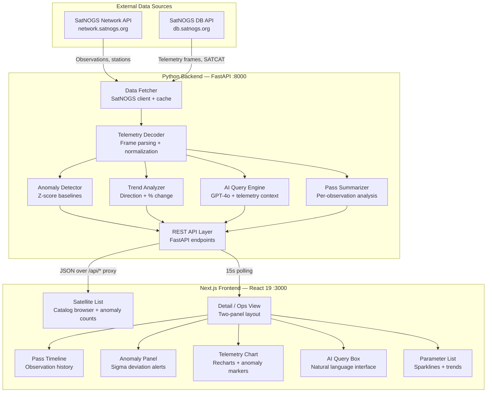
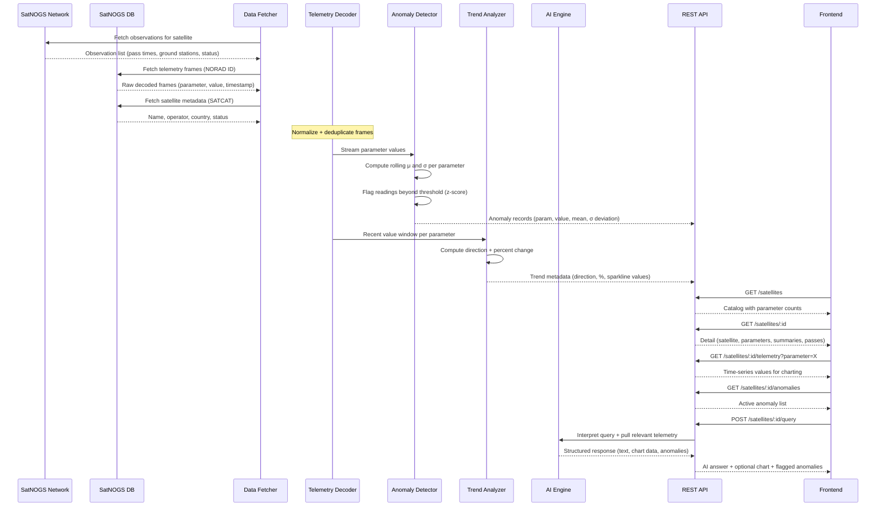

# Downlink

**Ground station telemetry intelligence for SatNOGS satellites.**

Pulls live observation data from the SatNOGS network, decodes telemetry frames across dozens of satellite parameters, runs statistical anomaly detection against historical baselines, and lets you ask natural language questions about spacecraft health — all through a mission-control interface that polls in real time.

### **[Live Demo →](https://downlink.vercel.app/)**

---

## Background

SatNOGS is a global network of open-source ground stations. Volunteers run antennas, the network schedules passes, and decoded telemetry frames end up in a public database. That database has millions of frames across hundreds of satellites — battery voltages, solar panel currents, onboard temperatures, RF power levels, attitude data.

The problem is that the raw data is just that: raw. The SatNOGS DB API gives you frames and timestamps. It doesn't tell you whether a battery voltage reading is normal or drifting. It doesn't flag when a solar current drops 40% between passes. It doesn't correlate a temperature spike with a ground station's observation window. You get data, not awareness.

I built Downlink because I wanted to point at a satellite and immediately know: is it healthy, is something changing, and what happened on the last pass. Not by manually pulling frames and computing statistics — by having a pipeline that does all of that continuously and tells me when something looks wrong.

---

## Why This Exists

Existing SatNOGS tools are built for data access — browse frames, download CSVs, check transmitter status. That's useful for satellite operators who already know what to look for. It's not useful for monitoring, where the point is to catch what you *didn't* expect.

Downlink bridges that gap. It takes the raw telemetry pipeline and adds three layers on top:

1. **Statistical baselines** — rolling means and standard deviations per parameter, so every new reading has context
2. **Anomaly detection** — sigma-based flagging that catches deviations without manual threshold tuning
3. **Natural language interface** — ask "what happened on the last pass?" and get an answer grounded in actual telemetry data, not a generic summary

The frontend is designed to look like a ground station ops console — dark, dense, monospaced data values, status dots, no visual noise. If something is nominal, the interface is quiet. If something is wrong, it's immediately visible.

---

## What It Actually Does

### Satellite Catalog

The landing page loads the full satellite catalog from the backend. Each satellite row shows:

- **NORAD ID** — monospaced, clickable, links to the detail view
- **Name** with country flag emoji (derived from the SATCAT country code)
- **Operator** — truncated with ellipsis for long names
- **Status dot** — green (alive), red (dead), orange (unknown)
- **Last contact** — ISO 8601 timestamp of the most recent telemetry fetch
- **Parameter count** — how many distinct telemetry parameters exist for this satellite
- **Anomaly count** — live count of detected anomalies, fetched in parallel for all telemetry-capable satellites

Satellites with active anomalies get a red left border and a red dot next to their name. The table is sortable: NORAD 39444 is pinned first (primary test satellite), then telemetry-capable satellites, then everything else.

**Filtering** works across name, NORAD ID, and operator in a single search box. A "telemetry only" toggle hides satellites without decoded data.

### Satellite Detail View

Clicking a satellite opens a two-panel ops view that polls every 15 seconds:

**Left panel (65%):**

| Section | What it shows |
|---|---|
| Observation timeline | Horizontal scrollable list of recent ground station passes, color-coded by status (green = good, orange = unknown, red = bad). Click to select a pass. |
| Anomaly panel | Inline red-bordered rows for every detected anomaly — parameter name, observed value, historical mean, sigma deviation, timestamp. Only appears when anomalies exist. |
| AI query box | Natural language input with example queries. Returns text answers, optional charts, and anomaly highlights. |
| Telemetry chart | Recharts line chart for the selected parameter. Shows historical mean as a dashed reference line. Anomalous readings are marked with red dots. Polls every 10 seconds. |

**Right panel (35%):**

A scrollable parameter list. Each row shows:
- Parameter name
- Current value (monospaced)
- Trend arrow — green ▲ for increasing, red ▼ for decreasing, hidden below 2% change
- Sparkline — tiny SVG line chart of recent values

Clicking a parameter switches the main chart. The active parameter gets a blue left border highlight.

### Anomaly Detection

The backend computes anomalies using z-score deviation from rolling statistical baselines:

1. For each telemetry parameter, maintain a running mean (μ) and standard deviation (σ) across all historical readings
2. When a new value arrives, compute `z = |value - μ| / σ`
3. Flag anything above a severity threshold

Each anomaly record carries:
- `parameter_name` — which parameter deviated
- `value` — the observed reading
- `mean` — the historical baseline it deviated from
- `deviation_sigma` — how many standard deviations away (e.g., 3.2σ)
- `severity` — classification label
- `timestamp` — when it happened

The frontend renders these as compact red-bordered rows, sorted by recency. On the satellite list page, anomaly counts are fetched concurrently using `Promise.allSettled` — a failed count for one satellite doesn't block the rest.

### AI Natural Language Queries

The query system accepts plain-English questions about a satellite's telemetry and returns structured responses:

```
POST /api/satellites/:norad_id/query
{ "query": "Battery voltage trend last 10 passes" }
```

The backend (GPT-4o) interprets the query, pulls relevant telemetry data, and returns:

| Field | Description |
|---|---|
| `answer_text` | Natural language response grounded in actual data |
| `intent.parameter_name` | Which parameter the query maps to (if applicable) |
| `chart_data` | If the answer involves a trend, returns data for chart rendering |
| `anomalies_flagged` | Array of anomalies relevant to the query |

When the response includes `chart_data` and a parameter name, the frontend automatically renders a telemetry chart for that parameter. When it includes `anomalies_flagged`, those are rendered as inline red-bordered rows with observed vs. mean values.

Example queries that ship with the UI:
- "Battery voltage trend last 10 passes"
- "Any anomalies in the last 24 hours?"
- "What happened recently?"
- "Compare solar current morning vs evening"

### Pass Summary Cards

For each ground station observation, the backend can generate a GPT-4o summary that classifies the pass as **NOMINAL** or flags anomalies:

- Green header with ✓ icon for nominal passes
- Red header with ⚠ icon for anomalous passes
- Pass duration displayed in minutes and seconds
- Natural language summary text
- Expandable parameter detail table — columns for parameter name, pass mean, historical mean, and status comparison

When the LLM is unavailable, the card shows a "No telemetry data to summarize" state rather than failing.

### Trend Analysis

Each parameter gets a trend computed from recent readings:

- **Direction** — `increasing`, `decreasing`, or `stable`
- **Percent change** — magnitude of the trend
- **Display threshold** — trend arrows only appear when change exceeds 2%, preventing visual noise from normal fluctuation

The sparkline in the parameter list gives a quick visual of the trajectory without needing to open the full chart.

### Real-Time Polling

The interface is designed to stay current without manual refresh:

| Component | Poll interval | Strategy |
|---|---|---|
| Satellite detail | 15 seconds | Full data refresh, no loading flash on subsequent polls |
| Telemetry chart | 10 seconds | Data refresh with sort stability, loading state only on first load |
| Anomaly counts | On page load | Parallel fetch via `Promise.allSettled`, non-blocking |

Both polling loops use a `mounted` flag to cancel stale responses when navigating away — no state updates on unmounted components.

---

## Design Decisions

**Why a mission-control aesthetic instead of a modern dashboard?**
Telemetry interfaces need to be scannable. Operators look at these screens for hours. Rounded corners, drop shadows, and gradient cards add visual weight that competes with the data. The design strips all of that: 2px border radius cap, box shadows killed globally, monospaced values, muted colors that only get bright when something needs attention. The scanline overlay (`repeating-linear-gradient` at 0.03 opacity) adds the CRT-terminal feel without affecting readability.

**Why poll instead of WebSockets?**
SatNOGS data doesn't update sub-second. Ground station passes happen on orbital periods (~90 minutes for LEO). Telemetry frames arrive in batches when a pass completes. Polling every 10–15 seconds catches new data within one cycle of the backend's own cache refresh. WebSockets would add connection management complexity for zero practical latency improvement.

**Why fetch anomaly counts in parallel with `Promise.allSettled`?**
The satellite list can have dozens of entries. Fetching anomaly counts sequentially would make the page feel slow. `allSettled` fires all requests concurrently and never rejects — if one satellite's anomaly endpoint is down, the rest still populate. A failed count defaults to 0 instead of breaking the list.

**Why Recharts instead of hand-rolled canvas?**
Telemetry charts need reference lines (historical mean), anomaly markers (red dots at specific data points), responsive sizing, and proper axis formatting. Recharts gives `ReferenceLine`, `ReferenceDot`, `ResponsiveContainer`, and custom tick formatters out of the box. The overhead is justified — these aren't simple sparklines.

**Why a separate sparkline component instead of Recharts?**
The parameter list renders one sparkline per parameter — potentially 30+ on screen. Recharts is too heavy for that. The sparkline is a 48×16px SVG polyline — no axes, no tooltips, no responsiveness needed. Renders in microseconds.

**Why proxy the backend through Next.js rewrites?**
The frontend runs on `:3000`, the backend on `:8000`. Instead of configuring CORS on FastAPI, the Next.js config rewrites `/api/*` to `http://127.0.0.1:8000/*`. Same-origin requests, no CORS headers, no preflight OPTIONS calls. Simpler in development and production.

**Why pin NORAD 39444 to the top of the list?**
That's the primary test satellite with the richest telemetry data. Pinning it ensures the first thing someone sees is a satellite with actual data to explore, not an empty detail view.

---

## Architecture



---

## Data Pipeline



---

## Tech Stack

| Layer | What | Why |
|---|---|---|
| Frontend framework | Next.js 16, React 19, TypeScript | Server components, file-based routing, fast HMR |
| Charts | Recharts 3 | Reference lines, anomaly dot markers, responsive containers — all built in |
| Icons | Lucide React | Tree-shakeable, consistent stroke weight |
| Styling | Tailwind CSS 4 | Dark mission-control design system with custom theme tokens |
| Class utilities | clsx + tailwind-merge | Conditional classes without duplicates |
| Typography | Inter (UI) + JetBrains Mono (data) | Clean sans-serif for labels, monospace for values and timestamps |
| Backend | Python, FastAPI, Uvicorn | Async endpoints, automatic OpenAPI docs |
| Data source | SatNOGS Network + DB APIs | Only open-source global ground station network |
| AI layer | GPT-4o (Azure OpenAI) | Structured telemetry Q&A with parameter extraction |
| Proxy | Next.js rewrites | `/api/*` → `localhost:8000`, eliminates CORS |

---


## Project Structure

```
Downlink/
├── src/
│   ├── app/
│   │   ├── layout.tsx              # Root layout — Inter + JetBrains Mono fonts, dark mode
│   │   ├── page.tsx                # Landing page — header bar + SatelliteSelector
│   │   ├── globals.css             # Design system — theme tokens, scanlines, overrides
│   │   └── satellite/
│   │       └── [norad_id]/
│   │           └── page.tsx        # Ops view — two-panel satellite detail with polling
│   ├── components/
│   │   ├── SatelliteSelector.tsx   # Catalog table with search, filter, anomaly counts
│   │   ├── TelemetryChart.tsx      # Recharts line chart with anomaly dots + mean line
│   │   ├── PassTimeline.tsx        # Horizontal scrollable observation timeline
│   │   ├── PassSummaryCard.tsx     # GPT-4o pass summary with expandable parameter table
│   │   ├── AnomalyPanel.tsx        # Inline anomaly warnings — param, value, mean, σ
│   │   └── AIQueryBox.tsx          # Natural language query input with example prompts
│   └── lib/
│       ├── api.ts                  # API client — all fetch functions, no-store cache
│       └── utils.ts                # cn() class merge + country flag emoji converter
├── public/
│   └── logo.png                    # Orbitwatch logo
├── next.config.ts                  # API proxy rewrite: /api/* → localhost:8000
├── package.json
└── tsconfig.json
```

---

## API Reference

All endpoints are proxied through Next.js at `/api/*` and forwarded to the FastAPI backend on port 8000.

| Method | Endpoint | Description |
|---|---|---|
| `GET` | `/satellites` | Full satellite catalog — name, NORAD ID, operator, status, parameter count |
| `GET` | `/satellites/:norad_id` | Satellite detail — metadata, parameter list, parameter summaries with trends, recent passes |
| `GET` | `/satellites/:norad_id/telemetry` | Telemetry time series. Query params: `parameter` (name), `last_n` (count, default 100) |
| `GET` | `/satellites/:norad_id/anomalies` | Detected anomalies — parameter, value, mean, sigma deviation, severity, timestamp |
| `GET` | `/satellites/:norad_id/trend/:parameter` | Trend analysis — direction, percent change, anomaly list for that parameter |
| `POST` | `/satellites/:norad_id/query` | AI query — send `{ "query": "..." }`, get structured answer with optional chart data |

---

## Getting Started

### Prerequisites

- Node.js 18+
- Python 3.11+ (for the backend)
- A SatNOGS DB API key (free — register at [db.satnogs.org](https://db.satnogs.org))
- Azure OpenAI credentials (optional — AI queries won't work without them, everything else does)

### Setup

```bash
# Clone
git clone https://github.com/yoohooshantanu/Downlink.git
cd Downlink

# Frontend
npm install
npm run dev
# Runs on http://localhost:3000

# Backend (separate terminal — see backend repo for setup)
# The frontend expects the API at http://localhost:8000
# All /api/* requests are proxied via next.config.ts rewrites
```

The frontend proxies all API calls through Next.js rewrites — no CORS configuration needed. Without the backend running, the UI will load but data fetches will fail gracefully.

---

## Limitations

This is a monitoring tool, not a satellite operations platform.

- **No command uplink.** Downlink is read-only. It ingests telemetry from SatNOGS — it doesn't transmit commands to spacecraft. That's a fundamentally different system with licensing, authentication, and hardware requirements.
- **Anomaly detection is statistical, not physics-based.** The z-score approach catches deviations from historical baselines. It doesn't model expected behavior — a battery voltage that drifts slowly over months won't trigger until it crosses the sigma threshold. No thermal models, no power budget simulation, no eclipse-cycle awareness.
- **AI answers depend on available telemetry.** The GPT-4o query system can only reference data the backend has ingested. If a satellite has sparse telemetry (few parameters, infrequent passes), the answers will be thin. The model also has no domain-specific fine-tuning — it's general-purpose, working with structured telemetry context.
- **SatNOGS data quality varies.** Ground station hardware, antenna gain, local RF interference, and decoder bugs all affect what ends up in the database. Some frames are corrupted. Some parameters have units that changed between firmware versions. Downlink trusts whatever the SatNOGS DB returns.
- **Single-satellite focus.** The detail view shows one satellite at a time. There's no cross-satellite comparison, no constellation-level dashboards, no fleet health overview. Each satellite is independent.
- **No offline mode.** Everything depends on the backend being reachable. No local caching of telemetry, no service worker, no IndexedDB fallback.

---

## What's Next

If I keep working on this:

- **Constellation dashboards** — group satellites by mission or operator, show fleet-level health at a glance
- **Eclipse-aware baselines** — separate statistical models for sunlit and eclipse phases, since solar panel current and battery behavior change predictably across the orbit
- **Webhook alerts** — push notifications when anomaly counts cross a threshold, instead of requiring someone to watch the screen
- **Frame-level inspection** — drill down from a parameter chart to the raw decoded frames that produced each data point
- **Historical playback** — scrub backwards through telemetry history instead of only seeing the latest window
- **Multi-ground-station correlation** — compare the same pass observed by different ground stations to identify station-specific noise vs. real satellite behavior

---

## References

- SatNOGS Network — [network.satnogs.org](https://network.satnogs.org) — global ground station scheduling and observation data
- SatNOGS DB — [db.satnogs.org](https://db.satnogs.org) — satellite catalog, transmitter database, decoded telemetry frames
- Libre Space Foundation — [libre.space](https://libre.space) — the organization behind SatNOGS
- NORAD Satellite Catalog — USSPACECOM-maintained catalog of tracked objects, referenced by NORAD ID throughout the interface
