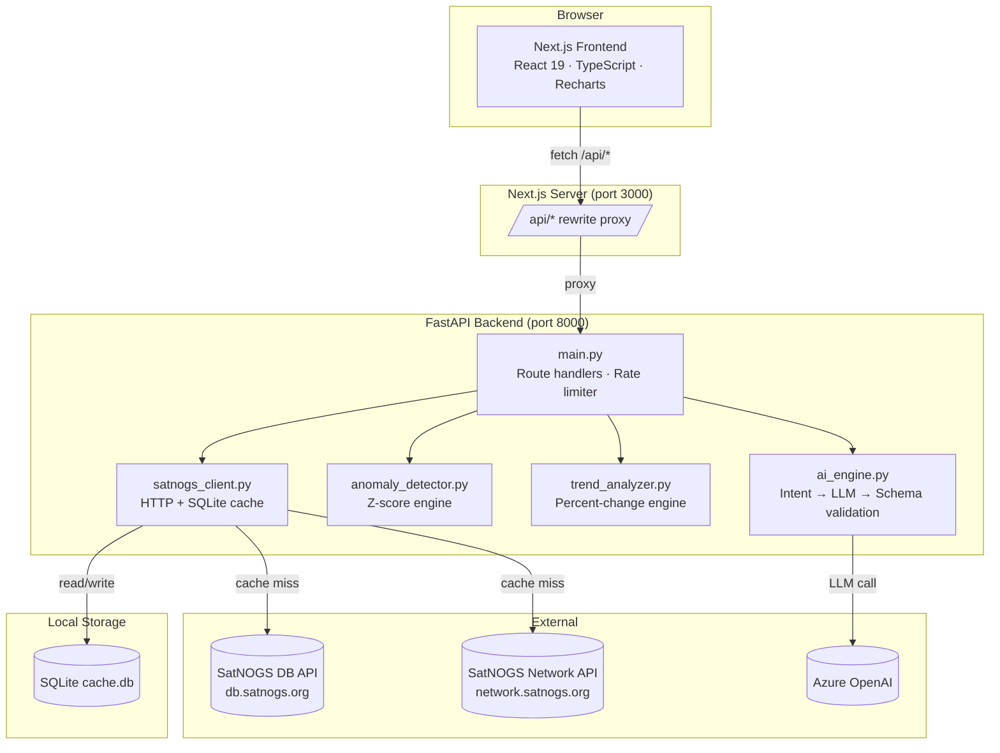
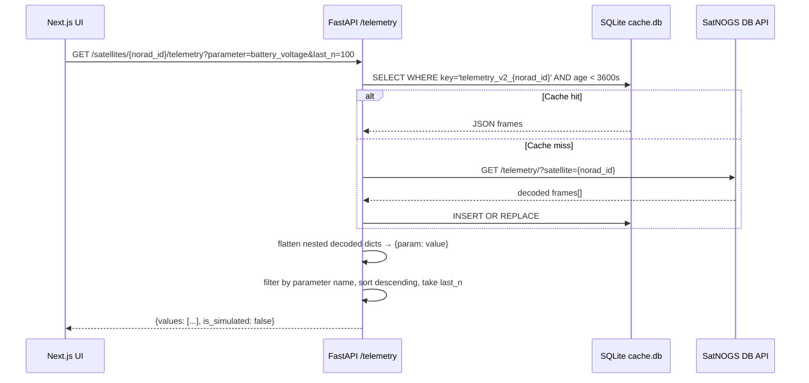
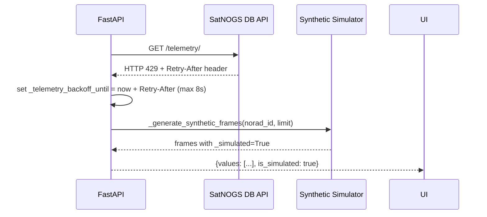
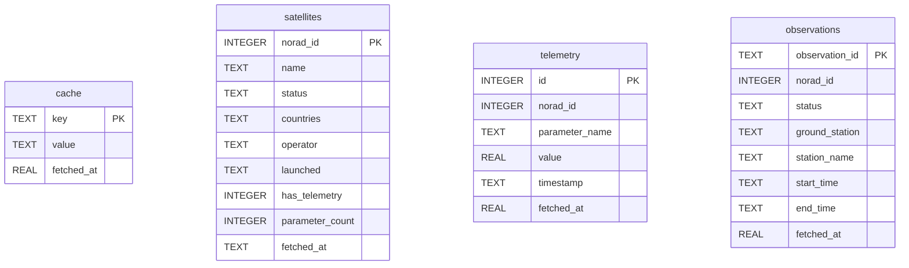
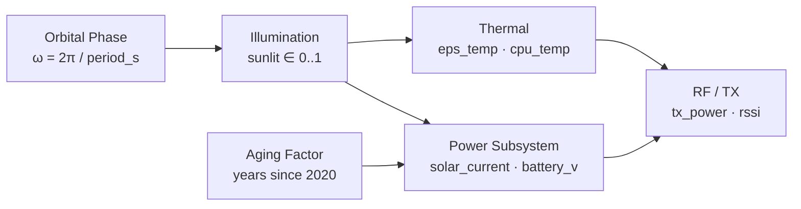
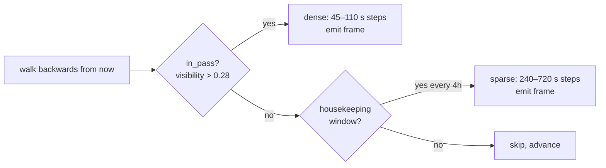
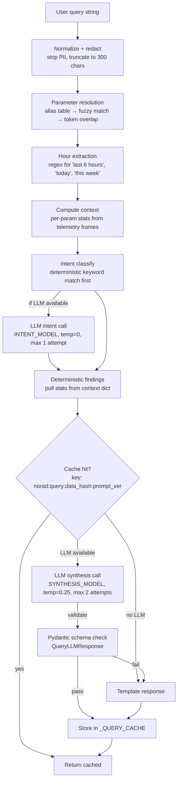
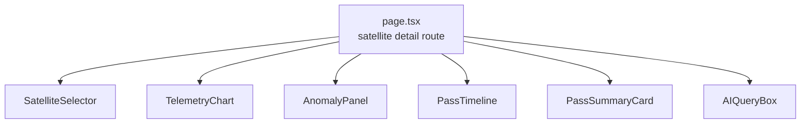
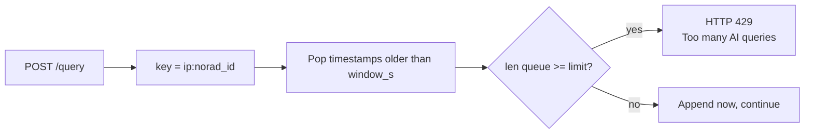

# Downlink

A ground-station telemetry dashboard for satellites tracked by [SatNOGS](https://satnogs.org/). Fetches decoded telemetry frames and pass observations from the SatNOGS APIs, runs z-score anomaly detection and trend analysis, and exposes a natural-language query interface backed by Azure OpenAI. When the SatNOGS API rate-limits requests, a deterministic simulator generates synthetic frames so the UI keeps working.

> **Demo / portfolio project.** The SatNOGS public API is heavily rate-limited — you will hit HTTP 429 within minutes of normal use, and many satellites have no decoded telemetry frames at all. The focus is the backend: caching, rate-limit-aware fallback, statistical analysis, and the AI query pipeline. All of that runs and returns real output regardless of whether the SatNOGS API is reachable.

---


## Table of Contents

1. [What This Is](#what-this-is)
2. [Architecture](#architecture)
3. [Data Flow](#data-flow)
4. [Backend Modules](#backend-modules)
   - [SatNOGS Client & Cache](#satnogs-client--cache)
   - [Synthetic Telemetry Simulator](#synthetic-telemetry-simulator)
   - [Anomaly Detector](#anomaly-detector)
   - [Trend Analyzer](#trend-analyzer)
   - [AI Engine](#ai-engine)
5. [API Reference](#api-reference)
6. [Frontend Components](#frontend-components)
7. [Rate Limiting](#rate-limiting)
8. [Setup](#setup)
9. [Environment Variables](#environment-variables)
10. [Known Limitations](#known-limitations)

---

## What This Is

SatNOGS is an open-source network of volunteer ground stations that receive and upload satellite signals. The decoded frames are available through a public API. That API is rate-limited, returns raw JSON with deeply nested payloads, and has no analysis layer — just rows.

Downlink adds:

- A **SQLite cache** so repeated polls don't hit the API every time
- A **telemetry simulator** that generates synthetic frames when the API is rate-limited or unreachable
- A **z-score anomaly detector** that flags the latest reading of any parameter if it's more than 2.5 standard deviations from its window mean
- A **trend analyzer** that computes direction and percent change across a frame window
- A **query endpoint** that accepts natural-language questions, classifies intent, extracts relevant stats, and optionally calls an LLM for a prose answer

The frontend is a Next.js app: a satellite catalog, a detail page per satellite (pass timeline, telemetry chart, anomaly panel, parameter list), and the query box.

---

## Architecture



---

## Data Flow

### Telemetry request (happy path)



### Telemetry request (rate-limited fallback)



---

## Backend Modules

### SatNOGS Client & Cache

`backend/satnogs_client.py` — 838 lines

The client talks to two separate SatNOGS APIs:

| API | Base URL | Auth |
|-----|----------|------|
| DB API | `https://db.satnogs.org/api` | `Authorization: Token <SATNOGS_API_TOKEN>` |
| Network API | `https://network.satnogs.org/api` | None required |

**SQLite schema** (`cache.db`):



**Cache TTLs:**

| Table / Key | TTL | Reason |
|-------------|-----|--------|
| `satellites_list_full_v2` | 86 400 s (24 h) | Catalog changes rarely |
| `satellite_{norad_id}` | 86 400 s (24 h) | Same — metadata is stable |
| `telemetry_v2_{norad_id}` | 3 600 s (1 h) | Frames arrive after passes end, not in real-time |
| `observations_{norad_id}` | 3 600 s (1 h) | Pass records don't change after the fact |

**HTTP retry logic** (inside `_get()`):

- Up to 3 attempts for transient 5xx and network errors
- Backoff: `0.6 × attempt` seconds between retries
- On `429`: reads `Retry-After` header (capped at 8 s), sets a process-level backoff timestamp for the telemetry endpoint, re-raises immediately without retrying

**Curated NORAD list** — 26 satellites known to have decoded telemetry on SatNOGS:

```
FUNcube-1 (39444)  ISS (25544)       FOX-1D/AO-92 (43137)
JY1SAT (43803)     GREENCUBE (53106) NAYIF-1/EO-88 (42017)
ESEO (43678)       CAS-6/TO-108 (47960)  NOAA 15/18/19 ...
```

These appear first in the catalog response. Up to 300 other satellites follow.

**Key-flattening** — decoded frames contain nested JSON. The client recurses the tree and produces dot-separated keys:

```
{"eps": {"battery": {"voltage": 8.1}}}
→ {"eps.battery.voltage": 8.1}
```

Only numeric (non-bool) leaves are kept. `_flatten_values()` is shared across the client, anomaly detector, trend analyzer, and AI engine.

---

### Synthetic Telemetry Simulator

When the API is rate-limited or unavailable, `_generate_simulated_payload()` generates telemetry values for each subsystem. Every output is **deterministic** — same `norad_id` + `timestamp` always gives the same numbers.

**Subsystems modeled:**



**Orbital mechanics (simplified):**

```
ω = 2π / orbit_period_s          # angular velocity
phase = epoch_unix × ω

sunlit = clamp(0.5 + 0.55 × (0.8·sin(phase) + 0.2·sin(2·phase)), 0, 1)
eclipse = 1 − sunlit
```

`orbit_period_s` is 5 400–6 200 s (90–103 min), seeded per NORAD ID so each satellite has its own orbit.

**Power subsystem:**

```
solar_current = panel_peak_A × sunlit × attitude_loss × aging_factor
net_charge    = (solar_current × 0.18) − (load × (0.65 + 0.35 × eclipse))
battery_v     = nom_v + swing_v × net_charge   [clamped 6.8–8.5 V]
```

**Thermal coupling to load:**

```
eps_temp = thermal_env + 2.0 × load_factor + noise
cpu_temp = eps_temp + cpu_offset + 1.8 × load_factor + noise
```

**RF derating (thermal + low-voltage):**

```
if cpu_temp > 56°C:  tx_power −= (cpu_temp − 56) × 0.025   (max −0.35 W)
if battery_v < 7.55: tx_power −= (7.55 − battery_v) × 0.35 (max −0.28 W)
```

**Short-lived events** — 3% of 15-minute windows trigger an event (MD5-keyed by `norad_id:window`):

| Event | Effect |
|-------|--------|
| `temp_spike` | `cpu_temp += 8 × intensity` |
| `battery_sag` | `battery_v −= 0.45 × intensity` |
| `panel_shadow` | `solar_current ×= (1 − 0.55 × intensity)` |
| `rf_fade` | `rssi −= 14 × intensity` |

**Frame generation cadence** (`_generate_synthetic_frames()`):



The chart shows a `⚠ Simulator Active` banner when any frame in the response has `_simulated: true`.

---

### Anomaly Detector

`backend/anomaly_detector.py`

Runs a z-score test on the **latest reading** of each parameter against the mean and stddev of up to 200 frames.

**Algorithm:**

```
μ = mean(all values for parameter)
σ = stddev(all values for parameter)
z = |latest_value − μ| / σ
```

| z-score | Severity |
|---------|----------|
| z > 2.5 | `warning` |
| z > 4.0 | `critical` |
| z ≤ 2.5 | (no anomaly) |

Minimum sample size is 5 readings. Parameters where σ = 0 (all identical values) are skipped to avoid division by zero.

**Response shape** per anomaly:

```json
{
  "parameter_name": "temp_cpu",
  "value": 72.4,
  "mean": 28.1,
  "deviation_sigma": 3.8,
  "severity": "warning",
  "timestamp": "2025-05-18T14:23:00Z"
}
```

---

### Trend Analyzer

`backend/trend_analyzer.py`

Computes simple first-to-last percent change across all frames for a named parameter.

```
pct_change = ((last − first) / |first|) × 100
```

| pct_change | direction |
|-----------|-----------|
| > +2% | `increasing` |
| < −2% | `decreasing` |
| −2% to +2% | `stable` |

`/trend/{parameter}` returns trend direction + percent change, plus anomalies filtered to that parameter.

---

### AI Engine

`backend/ai_engine.py` — 1 001 lines

LLM calls are optional. Without Azure OpenAI credentials the engine returns deterministic template responses built from the computed stats.



**Intent types:**

| Intent | Triggered by keywords |
|--------|-----------------------|
| `trend` | trend, history, over time, change, plot, chart |
| `anomaly` | anomaly, anomalies, outlier, abnormal, alert |
| `compare` | compare, vs, versus, difference, morning, evening |
| `pass_summary` | pass, observation, latest pass, last pass |
| `health_overview` | (default) |

**Parameter resolution order:**
1. Exact substring match of parameter name in query
2. Alias table lookup (e.g. "battery" → `battery_voltage`, "solar" → `solar_panel_current`)
3. `difflib.get_close_matches` fuzzy match (cutoff 0.55)
4. Token-overlap scoring between query words and parameter name tokens

**Two-model strategy:**

| Model slot | Env var | Role | Temperature |
|-----------|---------|------|-------------|
| Intent model | `AZURE_OPENAI_INTENT_DEPLOYMENT` | Classify intent + extract parameter | 0.0 |
| Synthesis model | `AZURE_OPENAI_SYNTH_DEPLOYMENT` | Generate `answer_text` prose | 0.25 |

Both can point to the same deployment. The split exists so you can use a smaller model for classification and a larger one for answer generation.

**Response cache** — in-memory dict keyed by `{norad_id}:{normalized_query}:{data_hash}:{prompt_version}`:

- TTL: 120 s (configurable via `AI_CACHE_TTL_SECONDS`)
- Max items: 800 (configurable via `AI_CACHE_MAX_ITEMS`)
- Eviction: expired entries first, then oldest by insertion time

`data_hash` is SHA-256 (truncated to 20 chars) over frame count, timestamp range, anomaly count, and parameter list. When the data changes the key changes, bypassing the cache.

**Confidence scoring:**

```
coverage = min(1.0, frame_count / 120)
if focused parameter: coverage = coverage×0.6 + param_coverage×0.4
anomaly_penalty = min(0.15, anomaly_count / 100)
parameter_bonus = min(0.10, param_count / 80)
score = clamp(coverage + parameter_bonus − anomaly_penalty, 0.05, 0.98)
```

Every response includes a `provenance` object: model name, pipeline stage (`intent`, `synthesis`, `fallback`, `template-fallback`), data hash, and prompt version.

---

## API Reference

FastAPI runs on port 8000. The Next.js config proxies `/api/*` → `http://127.0.0.1:8000/*`, so the browser only ever talks to port 3000.

| Method | Path | What it does |
|--------|------|--------------|
| `GET` | `/satellites` | Returns the curated catalog (26 prioritized + up to 300 others). Cached 24 h. |
| `GET` | `/satellites/{norad_id}` | Single satellite metadata + parameter list + summaries + last 10 passes in one response. |
| `GET` | `/satellites/{norad_id}/telemetry` | Time-series values for one parameter (or all parameters). `?parameter=battery_voltage&last_n=100` |
| `GET` | `/satellites/{norad_id}/anomalies` | Z-score anomalies across the last 200 frames. |
| `GET` | `/satellites/{norad_id}/trend/{parameter}` | Trend direction + percent change + per-parameter anomalies. |
| `GET` | `/satellites/{norad_id}/observations/{obs_id}/summary` | AI-generated summary for one specific pass. |
| `POST` | `/satellites/{norad_id}/query` | Natural-language telemetry query. Body: `{"query": "..."}` |
| `GET` | `/health` | Returns `{"status": "ok"}`. Used for uptime checks. |

### Example: telemetry response

```jsonc
// GET /satellites/39444/telemetry?parameter=battery_voltage&last_n=5
{
  "values": [
    {"timestamp": "2025-05-18T14:51:00Z", "value": 8.12},
    {"timestamp": "2025-05-18T14:49:00Z", "value": 8.09},
    {"timestamp": "2025-05-18T14:47:00Z", "value": 8.05},
    {"timestamp": "2025-05-18T14:45:00Z", "value": 7.98},
    {"timestamp": "2025-05-18T14:43:00Z", "value": 7.91}
  ],
  "is_simulated": false
}
```

### Example: AI query response

```jsonc
// POST /satellites/39444/query  {"query": "Is the battery voltage dropping?"}
{
  "answer_text": "battery_voltage: last=8.12, mean=8.03, change=+0.87% over 95 points. Trend: stable.",
  "intent": {"parameter_name": "battery_voltage"},
  "chart_data": true,
  "anomalies_flagged": [],
  "confidence": {
    "confidence_score": 0.84,
    "data_coverage": 0.79,
    "reason": "Good telemetry depth."
  },
  "provenance": {
    "prompt_version": "downlink-v2.1",
    "model_used": "gpt-4o",
    "model_stage": "synthesis",
    "intent": "trend",
    "data_hash": "a3f91b2c8e114d",
    "data_points_used": 95,
    "parameters_used": ["battery_voltage"],
    "time_window_start": "2025-05-17T10:00:00Z",
    "time_window_end": "2025-05-18T14:51:00Z"
  },
  "cache_hit": false
}
```

---

## Frontend Components

All components are in `src/components/`. The satellite detail page is `src/app/satellite/[norad_id]/`.



| Component | What it does |
|-----------|-------------|
| `SatelliteSelector` | Catalog search across name, NORAD ID, and operator. Curated satellites surface first. Shows `has_telemetry` badge and parameter count. |
| `TelemetryChart` | Recharts `LineChart`. Polls every 10 s — skips fetch if `document.visibilityState !== "visible"`. Fires `fetchTelemetry` + `fetchTrend` in parallel. Overlays anomaly `ReferenceDot` markers and a dashed historical mean line. Shows simulator banner when `is_simulated: true`. |
| `AnomalyPanel` | List of z-score anomalies (parameter, value, μ, σ deviation, UTC timestamp). At most 10 rows, hidden when empty. |
| `PassTimeline` | Horizontal bar per SatNOGS observation. Clicking a bar loads the pass summary. |
| `PassSummaryCard` | Calls `/observations/{obs_id}/summary` → AI engine summary: pass duration, per-param delta vs baseline, pass-window anomalies. |
| `AIQueryBox` | Free-text query → `POST /query`. Renders inline chart when `chart_data: true`, deviation table when `anomalies_flagged` non-empty. Exposes confidence score, model used, and cache hit in a collapsible `<details>`. |

---

## Rate Limiting

### AI query endpoint — sliding window per client IP + NORAD ID

`main.py` uses an in-process `defaultdict(deque)` — no external state.



Defaults (overridable via env):

| Variable | Default | Meaning |
|----------|---------|---------|
| `QUERY_RATE_WINDOW_S` | `60` | Rolling window in seconds |
| `QUERY_RATE_LIMIT` | `24` | Max requests per window per key |

### SatNOGS API — backoff-aware fetch

When the telemetry endpoint returns HTTP 429:
1. `Retry-After` header is read, capped at 8 s
2. `_telemetry_backoff_until = now + wait`
3. All telemetry requests during that window skip the API and go to the simulator
4. The variable lives in process memory — resets on restart

### Visibility-aware frontend polling

`TelemetryChart` uses `setInterval` at 10 s but checks `document.visibilityState` before each fetch:

```typescript
intervalId = setInterval(() => {
  if (document.visibilityState !== "visible") return;
  loadData(false);
}, 10000);
```

Background tabs make no requests after the initial load.

---

## Project Structure

```
Downlink/
├── backend/
│   ├── main.py              # FastAPI app, route handlers, rate limiter
│   ├── satnogs_client.py    # SatNOGS HTTP client + SQLite cache + simulator
│   ├── anomaly_detector.py  # Z-score anomaly detection
│   ├── trend_analyzer.py    # Percent-change trend analysis
│   ├── ai_engine.py         # Intent classification, LLM calls, response cache
│   ├── run.py               # Uvicorn entry point (dev reload)
│   ├── eval_ai.py           # Manual AI engine eval script
│   ├── test_api.py          # Quick API smoke tests
│   ├── test_client.py       # SatNOGS client unit tests
│   ├── requirements.txt
│   ├── cache.db             # SQLite cache (gitignored)
│   └── .env                 # Secrets (gitignored)
├── src/
│   ├── app/
│   │   ├── layout.tsx
│   │   ├── page.tsx         # Catalog / home page
│   │   └── satellite/
│   │       └── [norad_id]/  # Satellite detail page (dynamic route)
│   ├── components/
│   │   ├── AIQueryBox.tsx
│   │   ├── AnomalyPanel.tsx
│   │   ├── PassSummaryCard.tsx
│   │   ├── PassTimeline.tsx
│   │   ├── SatelliteSelector.tsx
│   │   └── TelemetryChart.tsx
│   └── lib/
│       └── api.ts           # Typed fetch wrappers for all endpoints
├── next.config.ts           # /api/* → http://127.0.0.1:8000/* rewrite
├── package.json
└── tsconfig.json
```

---

## Setup

### Prerequisites

| Requirement | Version |
|-------------|---------|
| Python | 3.11+ |
| Node.js | 18+ (20+ recommended) |
| SatNOGS API token | Required — get one at [network.satnogs.org](https://network.satnogs.org) |
| Azure OpenAI deployment | Optional — without it all AI responses use the deterministic template fallback |

### 1. Backend

```bash
cd backend
python -m venv venv
```

Activate the virtual environment:

```powershell
# Windows (PowerShell)
venv\Scripts\Activate.ps1
```

```bash
# macOS / Linux
source venv/bin/activate
```

Install dependencies:

```bash
pip install -r requirements.txt
```

Create `backend/.env` (copy from `.env.example` and fill in values):

```env
# Required
SATNOGS_API_TOKEN=your_token_here

# Optional — AI synthesis (omit entirely to use deterministic fallback)
AZURE_OPENAI_ENDPOINT=https://your-resource.openai.azure.com/
AZURE_OPENAI_API_KEY=your_key
AZURE_OPENAI_API_VERSION=2024-02-01
AZURE_OPENAI_DEPLOYMENT=gpt-4o          # base/fallback model
AZURE_OPENAI_INTENT_DEPLOYMENT=gpt-4o  # intent classification model
AZURE_OPENAI_SYNTH_DEPLOYMENT=gpt-4o   # synthesis model

# Optional — tuning
QUERY_RATE_WINDOW_S=60
QUERY_RATE_LIMIT=24
AI_CACHE_TTL_SECONDS=120
AI_CACHE_MAX_ITEMS=800
```

Start the backend:

```bash
python run.py
# → Uvicorn listening on http://localhost:8000
```

### 2. Frontend

From the repo root:

```bash
npm install
npm run dev
# → Next.js dev server on http://localhost:3000
```

Open `http://localhost:3000`. `/api/*` is proxied to `http://127.0.0.1:8000/*` via `next.config.ts`.

### Available scripts

| Location | Command | Description |
|----------|---------|-------------|
| repo root | `npm run dev` | Start Next.js dev server (HMR) |
| repo root | `npm run build` | Production bundle |
| repo root | `npm run start` | Serve production bundle |
| repo root | `npm run lint` | ESLint check |
| `backend/` | `python run.py` | Start FastAPI with Uvicorn (auto-reload) |

---

## Environment Variables

| Variable | Required | Default | Description |
|----------|----------|---------|-------------|
| `SATNOGS_API_TOKEN` | Yes | — | Bearer token for `db.satnogs.org/api`. SatNOGS Network API doesn't require auth. |
| `AZURE_OPENAI_ENDPOINT` | No | — | Full Azure endpoint URL. |
| `AZURE_OPENAI_API_KEY` | No | — | Azure OpenAI key. Falls back to `OPENAI_API_KEY`. |
| `AZURE_OPENAI_API_VERSION` | No | `2024-02-01` | API version string. |
| `AZURE_OPENAI_DEPLOYMENT` | No | — | Base model deployment name. |
| `AZURE_OPENAI_INTENT_DEPLOYMENT` | No | `AZURE_OPENAI_DEPLOYMENT` | Model for intent classification (can be smaller/faster). |
| `AZURE_OPENAI_SYNTH_DEPLOYMENT` | No | `AZURE_OPENAI_DEPLOYMENT` | Model for answer synthesis. |
| `QUERY_RATE_WINDOW_S` | No | `60` | Sliding window in seconds for AI query rate limiting. |
| `QUERY_RATE_LIMIT` | No | `24` | Max AI queries per window per `ip:norad_id` pair. |
| `AI_CACHE_TTL_SECONDS` | No | `120` | How long AI responses stay in the in-memory cache. |
| `AI_CACHE_MAX_ITEMS` | No | `800` | Maximum number of entries in the AI response cache before eviction. |

---

## Known Limitations

**Anomaly model is statistical only.** Z-score has no knowledge of orbital phase or expected subsystem ranges. A normal voltage dip during eclipse can trigger a `warning` if the sample window is short.

**Rate limiter is in-process.** The AI query sliding window lives in a `defaultdict` in memory. It resets on restart and doesn't carry over across multiple workers.

**SQLite under concurrency.** `aiosqlite` serializes writes through an async queue — fine for one user, a bottleneck under real concurrent load.

**No automated test suite.** `test_api.py` and `test_client.py` are manual smoke scripts, not CI tests.

**CORS is open.** `allow_origins=["*"]` — fine locally, needs tightening before any public deployment.

**No auth layer.** The Next.js proxy is the only thing between the browser and FastAPI.

**Data quality varies.** Many satellites have zero decoded frames on SatNOGS. `has_telemetry: false` may just mean the backend has never fetched that satellite before, not that no data exists.

---

## Security Notes

- `backend/.env` and `backend/cache.db` are both in `.gitignore` — don't commit either
- `main.py` redacts email addresses and long numeric strings from query text before writing to logs
